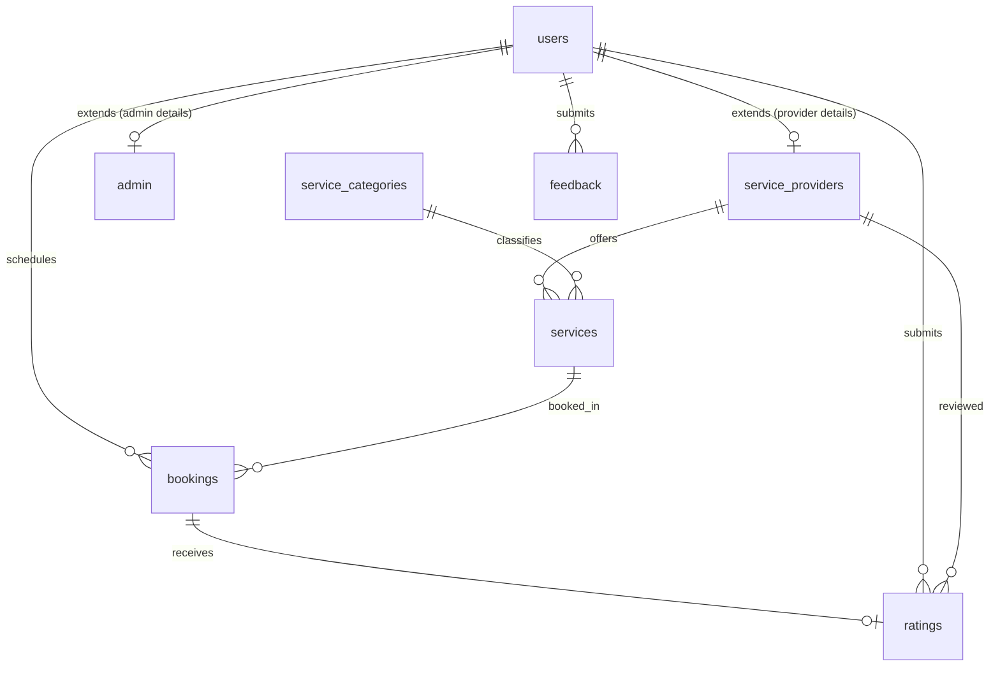
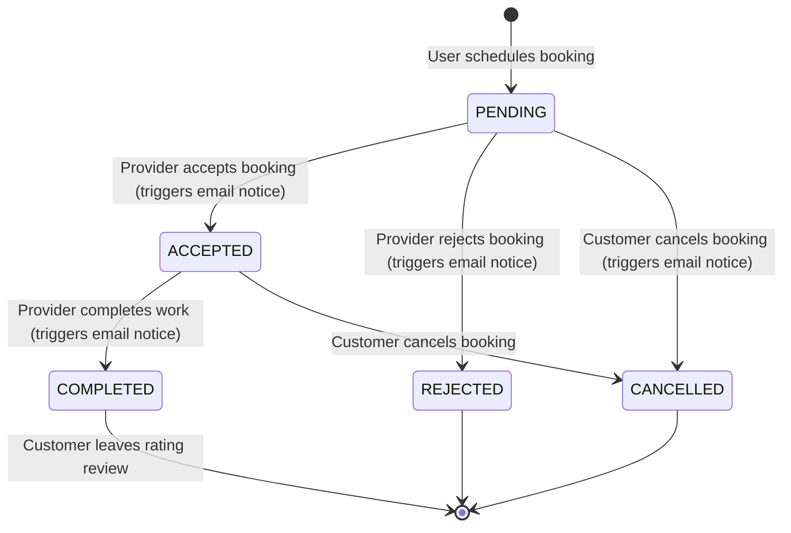
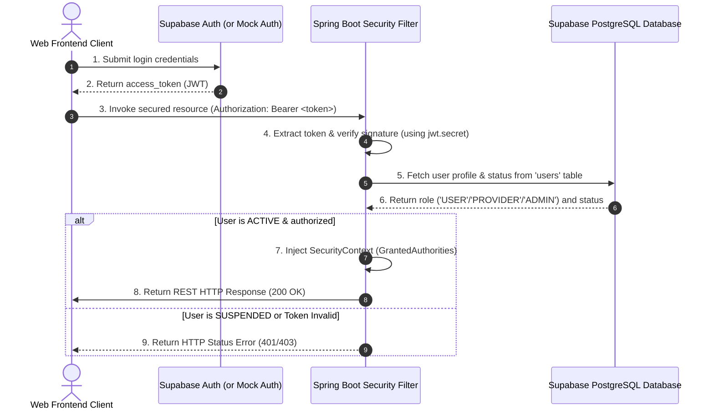

# Local Service Finder Web Application

A professional, production-ready platform that connects local service providers (plumbers, electricians, painters, tutors, cleaners, etc.) with customers. It features a complete Spring Boot REST API backend, secure JWT authentication integrated with Supabase, dynamic email status alerts, and a responsive Bootstrap 5 client interface.

---

## 🏗️ Project Architecture

```
d:\DA_V\HMW/
├── pom.xml                                     # Maven Dependencies
└── src/
    └── main/
        ├── java/
        │   └── com/
        │       └── localservicefinder/
        │           ├── LocalServiceFinderApplication.java # Spring Boot Entry
        │           ├── config/                 # Security, JWT and CORS Filters
        │           ├── controller/             # REST Endpoints Controllers
        │           ├── dto/                    # Data Transfer Objects
        │           ├── entity/                 # JPA / Hibernate Schema Mapping
        │           ├── repository/             # Data Access Layer Queries
        │           └── service/                # Core Business Logic Services
        └── resources/
            ├── application.properties          # Server & DB Settings
            ├── schema.sql                      # SQL Schema & Seeding Scripts
            └── static/                         # Responsive Web Frontend Assets
```

---

## 📊 System Diagrams

### 1. Entity Relationship (ER) Diagram


### 2. System Use Case Diagram

```mermaid
graph TD
    subgraph Roles
        U[Customer / User]
        P[Service Provider]
        A[Administrator]
    end

    subgraph Customer Use Cases
        U1(Browse Categories)
        U2(Search Services by Location & City)
        U3(Book a Service)
        U4(Submit Star Rating & Comments)
        U5(Contact via WhatsApp / Email)
        U6(Track Booking status)
        U7(Submit Support / Complaint Ticket)
    end

    subgraph Service Provider Use Cases
        P1(Create / Update Business Profile)
        P2(List / Modify Service Packages)
        P3(Accept / Reject Booking Requests)
        P4(Mark Booking as Completed)
        P5(Monitor Customer Reviews)
    end

    subgraph Administrator Use Cases
        A1(Approve / Verify Provider Profiles)
        A2(Suspend / Reactivate User Accounts)
        A3(Add / Modify Service Categories)
        A4(Resolve Customer Support Complaints)
        A5(View Dashboard Analytics Stats)
    end

    U --> U1
    U --> U2
    U --> U3
    U --> U4
    U --> U5
    U --> U6
    U --> U7

    P --> P1
    P --> P2
    P --> P3
    P --> P4
    P --> P5

    A --> A1
    A --> A2
    A --> A3
    A --> A4
    A --> A5
```


### 3. Booking Lifecycle Activity Diagram


### 4. JWT Authentication Sequence Diagram


---

## 📡 REST API Documentation

### 🔓 Public Endpoints
*   `POST /api/auth/register` - Create a customer, provider, or administrator account.
*   `POST /api/auth/login` - Authenticate using email & password. Returns a JWT token.
*   `GET /api/categories` - Fetch all listed service categories (Plumbing, Electrical, etc.).
*   `GET /api/services/search` - Multi-criteria search listings. Supports query parameters `query`, `categoryId`, `city`.
*   `GET /api/services/category/{id}` - List all listings belonging to a category ID.
*   `GET /api/services/provider/{id}` - List all services offered by provider UUID.
*   `GET /api/services/detail/{id}` - Fetch single service details.
*   `GET /api/providers/public/{id}` - Fetch public profile, reviews, and average rating for provider UUID.

### 👤 Customer Endpoints (Header: `Authorization: Bearer <token>`, Role: `USER`)
*   `GET /api/auth/me` - Validate session and retrieve user context.
*   `GET /api/user/profile` - Fetch profile metadata.
*   `PUT /api/user/profile` - Update full name, phone number, and avatar image.
*   `GET /api/user/bookings` - List all bookings made by customer.
*   `POST /api/user/bookings` - Place a service booking.
*   `PUT /api/user/bookings/{id}/cancel` - Cancel a scheduled booking.
*   `POST /api/user/bookings/{id}/rate` - Review a completed booking (rating value 1-5 & text comments).
*   `POST /api/user/feedback` - Submit support tickets or file complaints to administrator.

### 🛠️ Provider Endpoints (Header: `Authorization: Bearer <token>`, Role: `PROVIDER`)
*   `GET /api/provider/profile` - Fetch detailed business profile.
*   `PUT /api/provider/profile` - Update bio, address, city, experience, and WhatsApp number.
*   `GET /api/provider/bookings` - List job requests received.
*   `PUT /api/provider/bookings/{id}/status` - Update booking state (`ACCEPTED`, `REJECTED`, `COMPLETED`).
*   `GET /api/provider/ratings` - Fetch reviews list and overall average rating.
*   `POST /api/provider/services` - List a new service package.
*   `PUT /api/provider/services/{id}` - Update a service package.
*   `DELETE /api/provider/services/{id}` - Delete a service package.

### 🔑 Admin Endpoints (Header: `Authorization: Bearer <token>`, Role: `ADMIN`)
*   `GET /api/admin/stats` - Fetch dashboard statistics overview.
*   `GET /api/admin/users` - List all accounts in the system.
*   `GET /api/admin/providers` - List all business provider profiles.
*   `PUT /api/admin/providers/{id}/approve` - Verify provider account (enables listing services publicly).
*   `PUT /api/admin/users/{id}/status` - Set user account status to `ACTIVE` or `SUSPENDED`.
*   `POST /api/admin/categories` - Create a service category.
*   `DELETE /api/admin/categories/{id}` - Delete a service category.
*   `GET /api/admin/feedback` - List support/complaints ticket logs.
*   `PUT /api/admin/feedback/{id}/resolve` - Mark complaint ticket status as `RESOLVED`.

---

## ⚙️ Project Setup Guide

### 📋 Prerequisites
1.  **Java JDK 17** or higher.
2.  **Apache Maven 3.8+**
3.  **Supabase PostgreSQL Database** (or any local PostgreSQL instance).

### 🛠️ Local Environment Settings
Modify your `src/main/resources/application.properties` or set the following system environment variables:
```properties
DB_HOST=your-supabase-db-host.supabase.co
DB_PORT=5432
DB_NAME=postgres
DB_USER=postgres
DB_PASSWORD=your-database-password

# Project Settings > API > JWT Secret
JWT_SECRET=your-supabase-jwt-secret-string-at-least-256-bits

# Transactional Mail configuration (e.g. Mailtrap, Sendgrid or Gmail SMTP)
MAIL_HOST=smtp.mailtrap.io
MAIL_PORT=2525
MAIL_USERNAME=your-smtp-username
MAIL_PASSWORD=your-smtp-password
```

### ⚡ Build & Start Application
Run the following commands in the root workspace directory:
```bash
# Clean compilation and package
mvn clean install

# Launch Spring Boot Server
mvn spring-boot:run
```
The server will start up on `http://localhost:8080`.
The database schemas and seed tables will be initialized automatically on startup from `schema.sql`.

---

## 🚀 Supabase Deployment Guide

### 1. Database Configuration
1.  Go to your **Supabase Dashboard** > **SQL Editor**.
2.  Open a new query editor tab.
3.  Copy and paste the contents of `src/main/resources/schema.sql` and click **Run**.
4.  This creates the `users`, `service_providers`, `admin`, `service_categories`, `services`, `bookings`, `ratings`, and `feedback` tables and indexes with initial category and mock data.

### 2. Syncing Supabase Authentication (JWT Secret)
1.  Navigate to **Project Settings** > **API**.
2.  Locate the **JWT Secret** field and copy the key string.
3.  Provide this key as the `JWT_SECRET` environment variable or set it as the value of `jwt.secret` in your Java application properties.
4.  When client requests come in, they request Supabase Authentication on the front end, retrieve the JWT, and include it in the `Authorization: Bearer <token>` header of REST API calls. Spring Boot uses this JWT Secret key to decrypt and validate the user UUID and email signatures stateless.

---

## 🧪 Testing Credentials (Local Mock Fallback)
If the `jwt.secret` properties remain configured as the default placeholder value, the application automatically runs a **signature-bypass local verification mode** so developers can test the system instantly:
*   **Admin Access**: Sign in with `admin@servicefinder.com` and password `password`.
*   **Customer Access**: Sign in with `customer.bob@servicefinder.com` and password `password`.
*   **Approved Provider Access**: Sign in with `provider.john@servicefinder.com` and password `password`.
*   **Pending Provider Access**: Sign in with `provider.alice@servicefinder.com` and password `password`.
